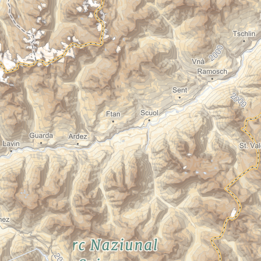

# Alps

A more colorful approach to terrain-based cartography, heavily inspired by Eduard Imhof.

### Map Data Layers

Alps uses the following MapBox Studio source layers:

* mapbox.mapbox-streets-v5 *Map data © OpenStreetMap contributors*
* mapbox.mapbox-terrain-v2
